# Astra – Multilingual Voice RAG Assistant

## Overview

Astra is a full-stack AI-powered voice assistant that combines Retrieval-Augmented Generation (RAG), voice interaction, memory, and document-based question answering.

Users can upload PDF documents, ask questions through voice or text, and receive intelligent responses powered by Gemini AI, Whisper, and ChromaDB.

The system supports multilingual conversations, answer saving, conversation memory, and source-aware responses through an interactive futuristic interface.

---

## Features

### AI & RAG

* PDF-based Retrieval-Augmented Generation (RAG)
* ChromaDB vector database for semantic search
* Gemini AI-powered answer generation
* Source-aware responses
* Context retrieval from uploaded documents

### Voice Capabilities

* Speech-to-Text using Whisper
* Text-to-Speech response generation
* Voice-based interaction
* Real-time voice assistant experience

### Memory System

* Conversation memory storage
* Previous interaction recall
* SQLite-based memory management

### User Experience

* Interactive AI Orb Interface
* Modern glassmorphism UI
* Saved responses system
* Swipe-to-open saved responses
* Swipe-to-delete saved responses
* Source badges and response cards

---

## Tech Stack

### Frontend

* React.js
* CSS3
* Framer Motion

### Backend

* FastAPI
* Python

### AI & Data

* Google Gemini
* Whisper
* ChromaDB
* SQLite

---

## Project Architecture

User Question
↓
Voice/Text Input
↓
Whisper Speech Recognition
↓
RAG Retrieval (ChromaDB)
↓
Gemini AI
↓
Answer Generation
↓
Text-to-Speech
↓
Response Card + Voice Output

---

## Screenshots

# 📸 Project Demonstration

## 🏠 Home Interface

The futuristic dashboard displaying Astra's AI orb, response panel, knowledge base status, AI engine status, and upload functionality.

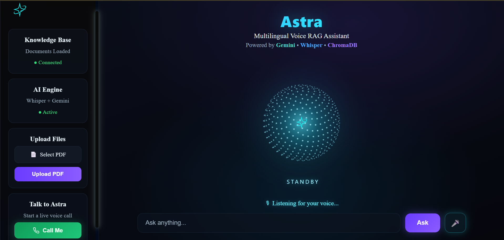

---

## 💬 AI Response Generation

Astra answers user questions using Gemini AI combined with Retrieval-Augmented Generation (RAG).

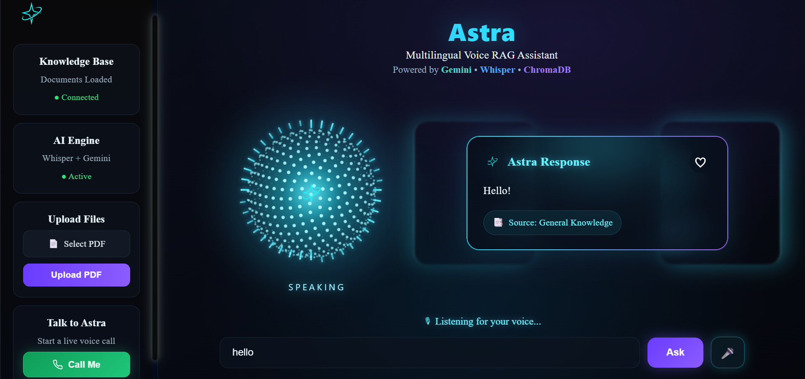

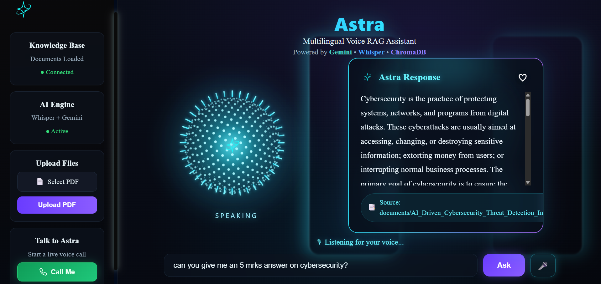

---

## 📄 PDF-Based Question Answering

Users can upload PDF documents and ask questions directly from their own knowledge base.

### Upload PDF

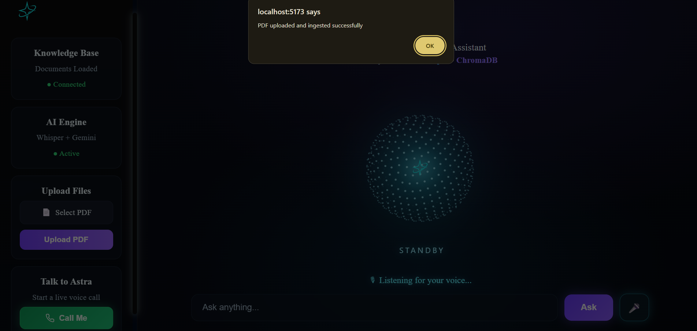

### RAG Response

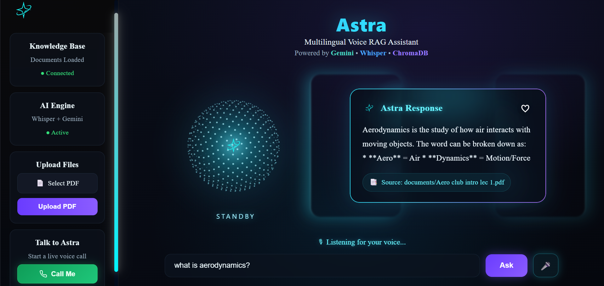

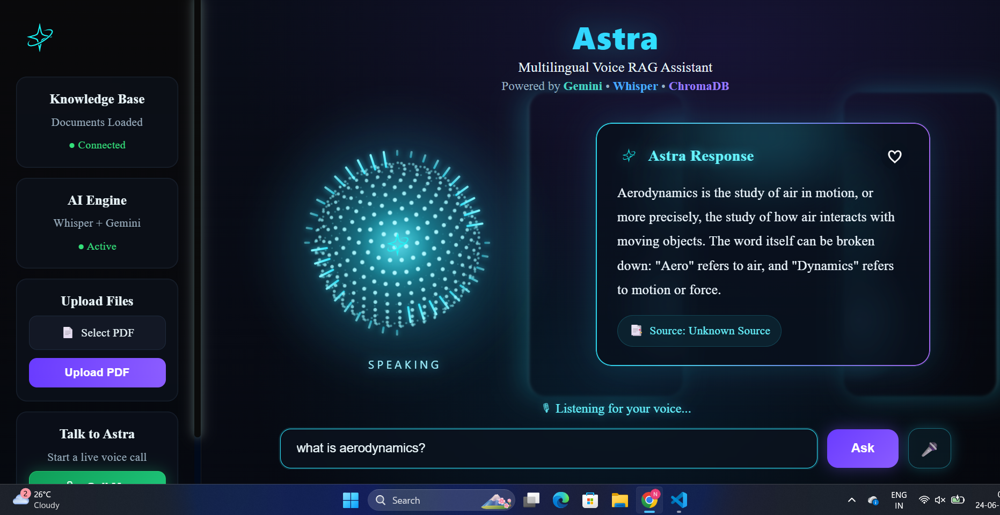

---

## 🎤 Voice Assistant

Astra supports voice interaction using Whisper Speech-to-Text and Text-to-Speech.

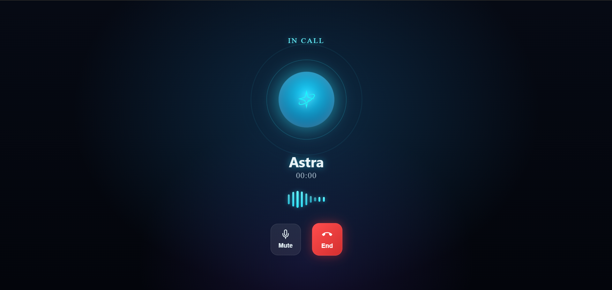

---

## ❤️ Saved Responses

Users can save important AI responses for later viewing.

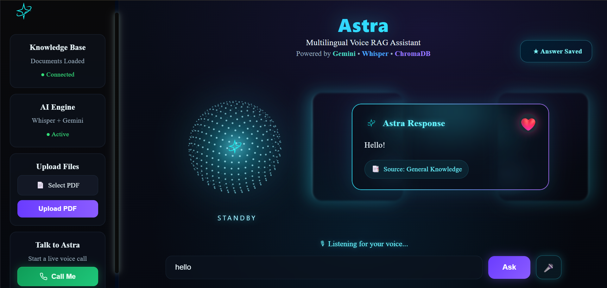

### Opening a Saved Response

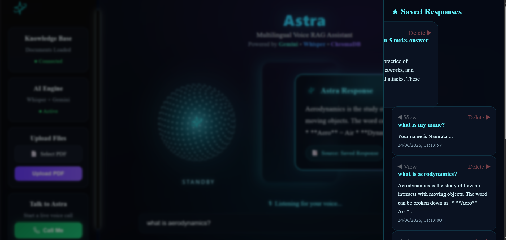

### Viewing a Saved Response

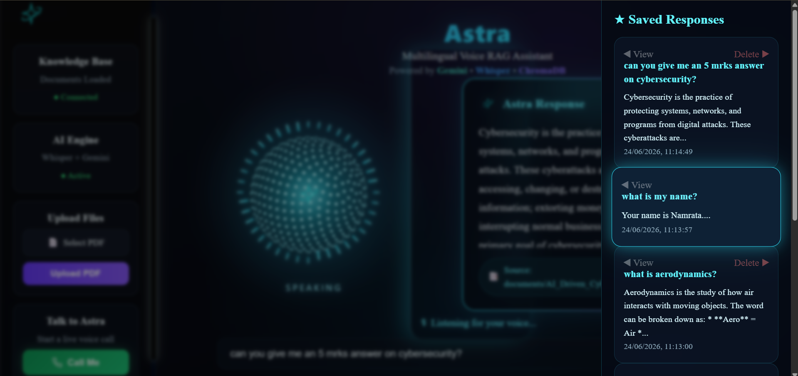

### Swipe to Delete

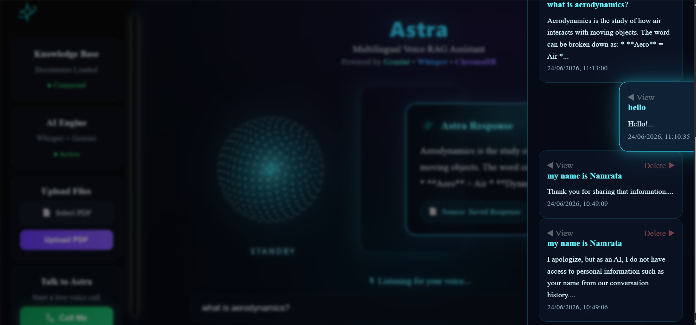

---

## 🧠 Memory Recall

Astra remembers previous conversations using SQLite memory storage and can recall user information without sending every request to the LLM.

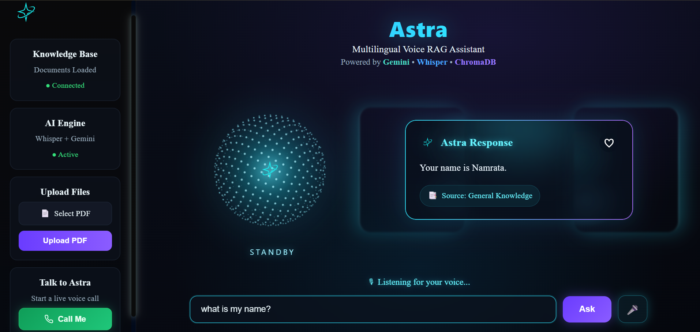

---

## 🚀 End-to-End Workflow

1. Upload your documents.
2. Ask questions through text or voice.
3. Astra retrieves relevant context using ChromaDB.
4. Gemini generates intelligent answers.
5. Responses can be spoken aloud.
6. Important answers can be saved.
7. Memory enables personalized conversations.

## Installation

### Clone Repository

git clone https://github.com/namratathomas29-collab/voice-rag-agent.git

cd voice-rag-agent

### Backend Setup

cd backend

pip install -r requirements.txt

uvicorn main:app --reload

### Frontend Setup

cd frontend

npm install

npm run dev

---

## Future Improvements

* Memory-first retrieval architecture
* User authentication
* Cloud deployment
* Advanced conversation analytics
* Real-time voice calling
* Personalized AI memory profiles

---

## Author

Namrata Thomas Bansode

BCA Graduate | Java Developer | AI & Full-Stack Enthusiast
